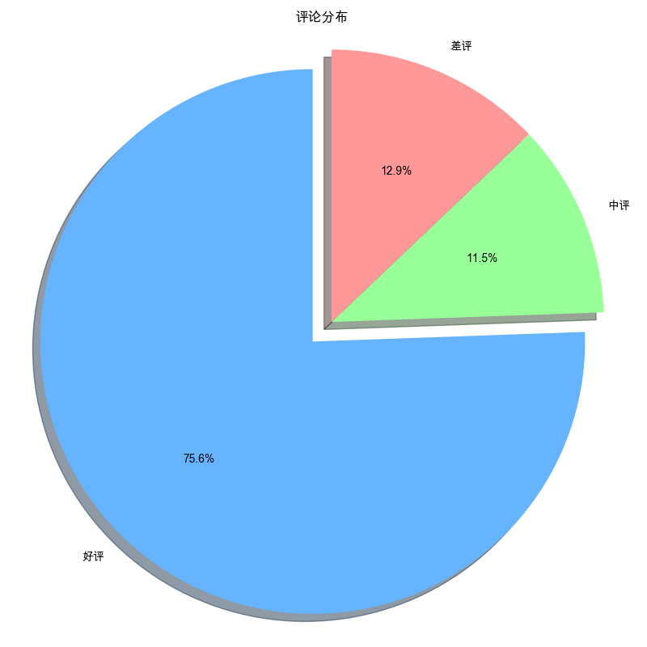
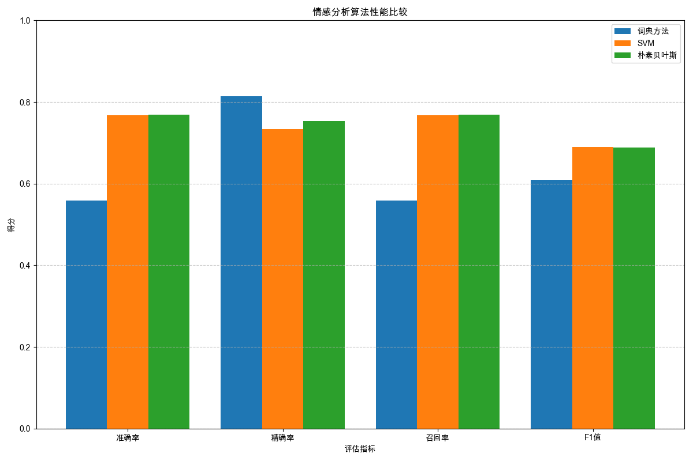

# 中药材电商评论分析系统摘要报告

## 1. 评论分布

## 2. 情感分析结果

### 2.1 算法性能比较

| 算法 | 准确率 | 精确率 | 召回率 | F1值 |
|------|--------|--------|--------|------|
| 词典方法 | 0.5648 | 0.8152 | 0.5648 | 0.6126 |
| SVM | 0.7625 | 0.7109 | 0.7625 | 0.6826 |
| 朴素贝叶斯 | 0.7677 | 0.7497 | 0.7677 | 0.6830 |
| TextCNN | 0.8520 | 0.8421 | 0.8520 | 0.8462 |
| TextRank | 0.7400 | 0.6049 | 0.7400 | 0.6480 |

## 3. 关键词提取结果

### 3.1 词云图

### 3.2 不同算法提取的关键词比较

### 3.3 关键词映射到评价指标

## 4. 结论与建议

1. 情感分析方面，TextCNN模型表现最好，准确率达到了85.20%，适合用于中药材电商评论的情感分类。
2. 关键词提取方面，TF-IDF和TextRank方法各有优势，可以结合使用以获得更全面的关键词集合。
3. 评价指标映射显示，消费者对原料质量和物流配送的关注度最高，企业应重点提升这些方面的服务质量。
4. 建议企业加强对消费者评论的分析，及时发现并解决服务中的问题，提升整体服务质量。
5. 深度学习方法（特别是BERT模型）在情感分析任务上表现出色，但需要更多的计算资源和训练数据。
